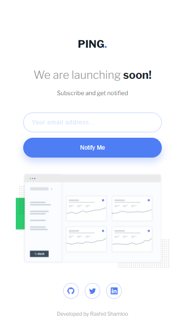

# Front End Mentor - Project 016 - Ping single column coming soon page

This is a solution to the [Ping single column coming soon page challenge on Frontend Mentor](https://www.frontendmentor.io/challenges/ping-single-column-coming-soon-page-5cadd051fec04111f7b848da).

## Table of contents

- [Overview](#overview)
  - [Screenshot](#screenshot)
  - [Links](#links)
- [My process](#my-process)
  - [Built with](#built-with)
  - [What I learned](#what-i-learned)
  - [Useful resources](#useful-resources)
- [Author](#author)

## Overview

### Screenshot

- Desktop

- Mobile

### Links

- Solution URL: https://github.com/rashidshamloo/fem_016_ping-coming-soon-page/
- Live Site URL: https://rashidshamloo.github.io/fem_016_ping-coming-soon-page/

## My process

### Built with

- Semantic HTML5 markup
- Sass
- CSS Flexbox
- Vanilla Javascript

### What I learned

- Using "@mixin" in Sass
- Implementing responsive layouts based on viewport height instead of width

### Useful resources

- [Javascript Email Validation](https://www.w3resource.com/javascript/form/email-validation.php) - I used a modified version of the regular expression listed on this page to validate the email. (increased the tld character limit from 3 to 10)

## Author

- Frontend Mentor - [@rashidshamloo](https://www.frontendmentor.io/profile/rashidshamloo)
- Twitter - [@rashidshamloo](https://www.twitter.com/rashidshamloo)
